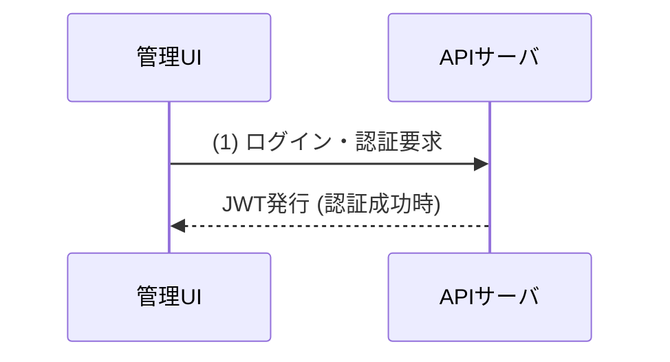
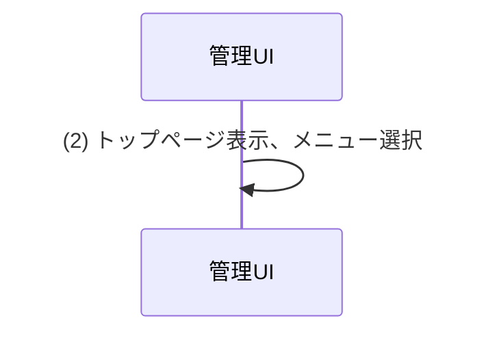
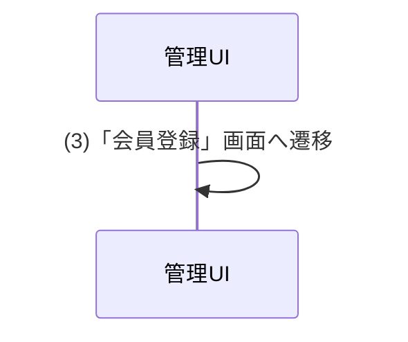
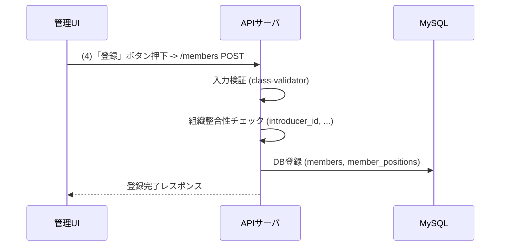
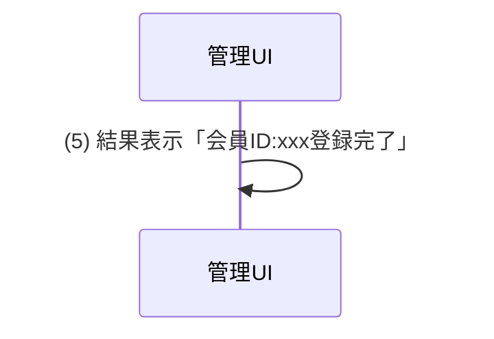
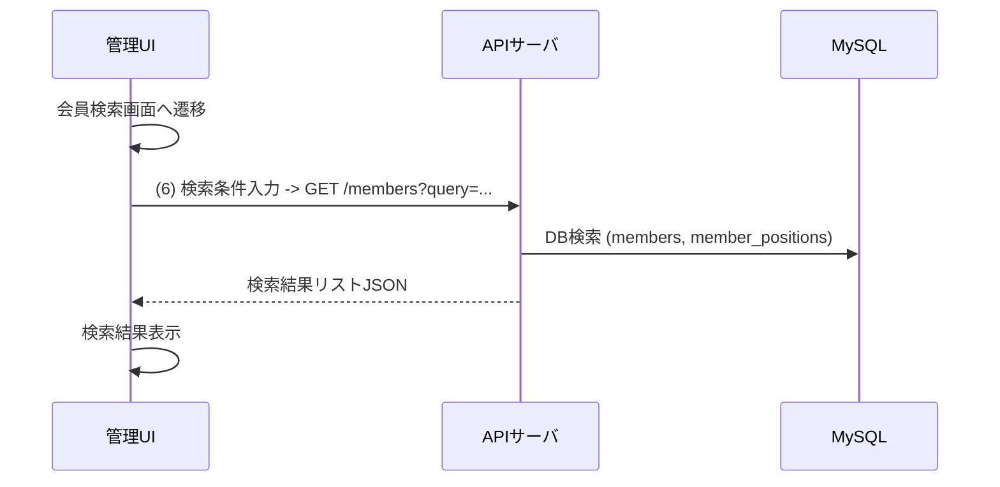
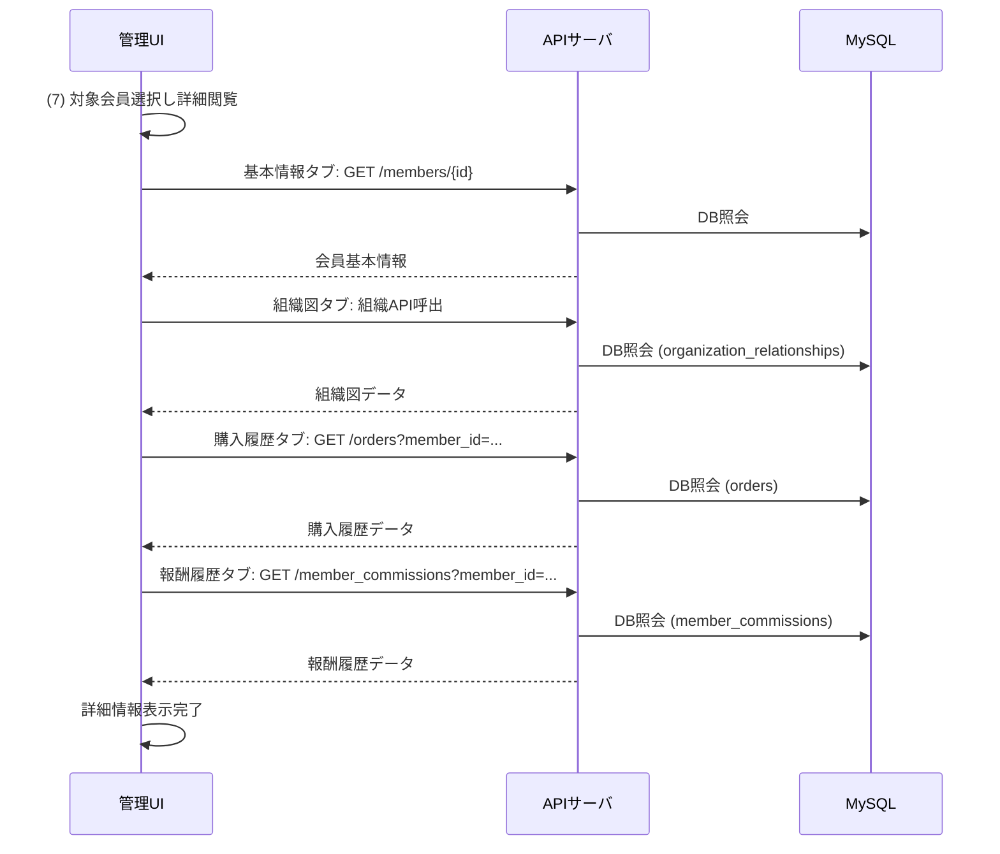
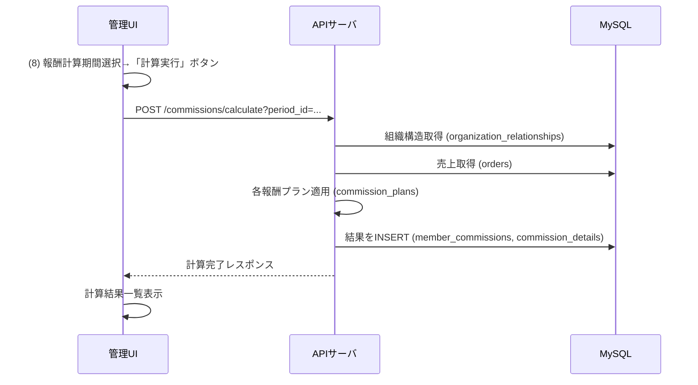
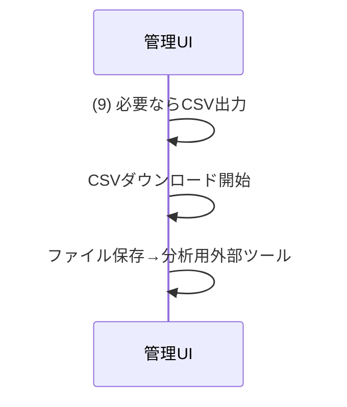
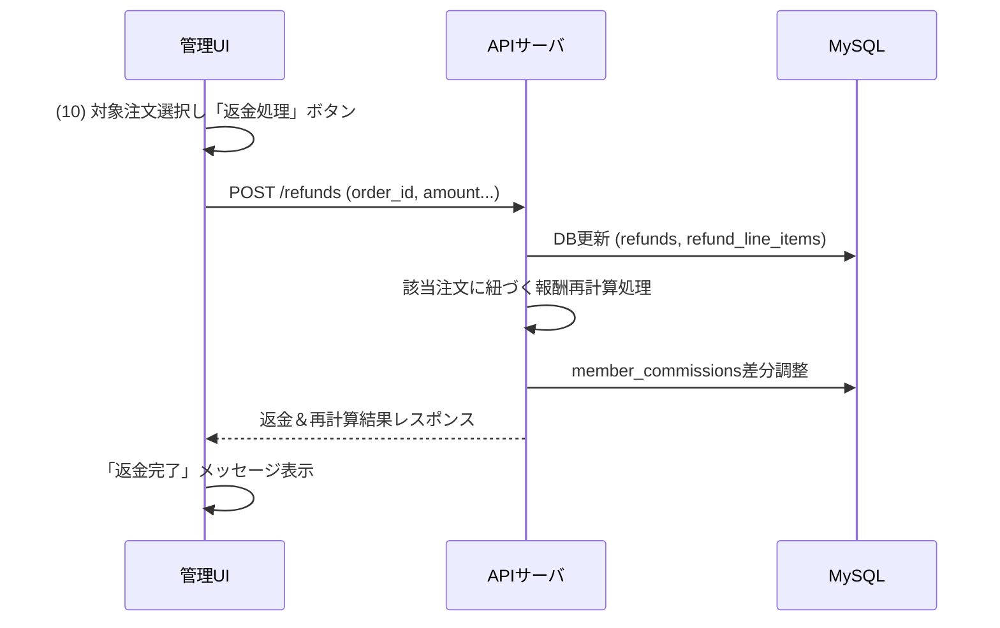

## アプリケーション上位フローチャート

### 1. ログイン・認証

- 管理UIからAPIサーバへログイン情報を送信し、認証を要求します。
- APIサーバはユーザー情報を検証し、成功すればJWTを発行して管理UIに返します。

### 2. トップページ表示・メニュー選択

- 認証後、管理UIはトップページを表示し、ユーザーはメニューから操作を選択します。

### 3. 会員登録画面へ遷移

- ユーザーが会員管理機能から「会員登録」画面へ遷移します。

### 4. 会員登録処理

- 管理UIで入力された会員情報がAPIサーバへ送信されます。
- APIサーバは入力検証と組織整合性チェックを行い、問題がなければDBに会員情報を登録します。
- 登録完了後、レスポンスを管理UIへ返します。

### 5. 会員登録完了表示

- 管理UIは登録完了メッセージを表示します。

### 6. 会員検索処理

- ユーザーが会員検索画面で検索条件を入力し、APIサーバへ検索リクエストを送信します。
- APIサーバはDBを検索し、結果をJSON形式で管理UIへ返します。
- 管理UIは検索結果を表示します。

### 7. 会員詳細情報閲覧

- ユーザーが検索結果から対象会員を選択し、詳細情報を閲覧します。
- 管理UIは必要な情報を各APIエンドポイントから取得し、タブごとに表示します。

### 8. 報酬計算処理

- 管理者が報酬計算期間を選択し、計算を実行します。
- APIサーバは組織構造、売上情報を取得し、設定された報酬プランに基づいて計算を行い、結果をDBに保存します。
- 計算完了後、レスポンスを管理UIへ返し、結果一覧を表示します。

### 9. 報酬計算結果CSV出力

- 管理UIは報酬計算結果をCSV形式で出力し、ユーザーはダウンロードして外部ツールで分析できます。

### 10. 返金処理（クーリングオフ）

- 管理者が返金対象の注文を選択し、返金処理を実行します。
- APIサーバは返金情報をDBに登録し、関連する報酬情報を再計算してDBを更新します。
- 処理完了後、管理UIに結果を表示します。

---

## ポイント

1. **認証フロー**: ログイン時にユーザー情報を検証し、JWTを発行。その後のAPIアクセス時にJWTヘッダを検証。(ステップ1)
2. **会員登録フロー**: ユーザが管理画面で会員情報を入力→APIサーバで組織整合性チェック→DB登録。(ステップ3, 4)
3. **会員検索・参照フロー**: 検索条件をフロントで入力→APIでDB検索→結果一覧表示→詳細画面へ遷移して各種タブ情報を別々のAPIで取得。(ステップ6, 7)
4. **報酬計算フロー**: 計算期間を選択→バックエンドで報酬ロジック実行→計算結果をDBへ→フロントで結果一覧表示・CSV出力。(ステップ8, 9)
5. **返金・クーリングオフ対応フロー**: 対象注文指定→バックエンドで返金登録＆報酬差戻し計算→結果をフロントへ返し表示。(ステップ10)